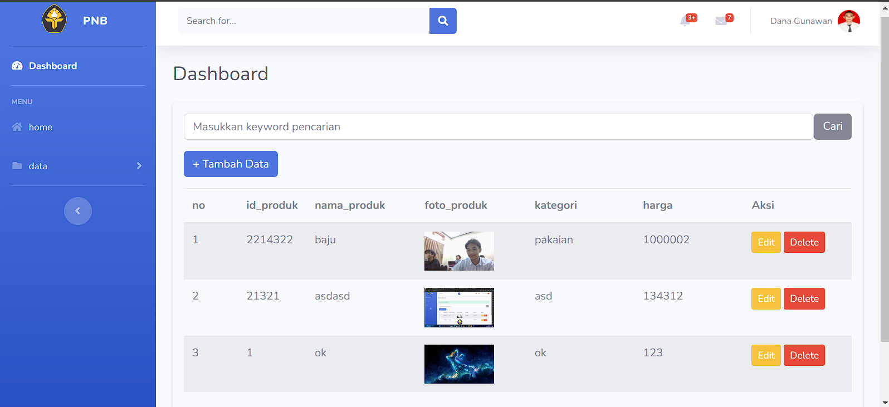
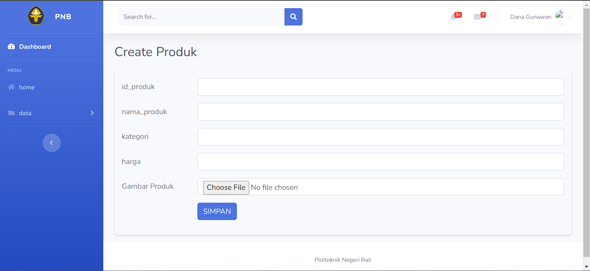
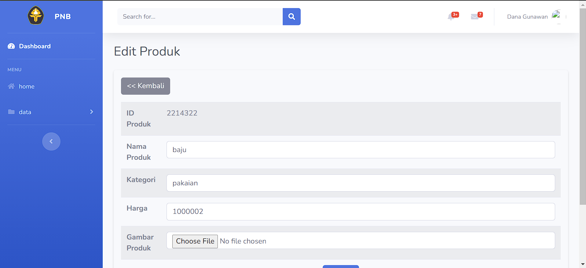

# Proyek Laravel 11

Proyek ini mencakup Dashboard Admin, operasi CRUD untuk Produk dengan Gambar, dan operasi CRUD untuk Data Mahasiswa.

## Fitur
- Dashboard Admin
- CRUD Produk dengan Gambar
- CRUD Data Mahasiswa

## Panduan Instalasi

### Prasyarat
- Composer
- XAMPP atau server web dengan PHP dan MySQL
- Laravel 11

### Langkah-langkah

1. **Clone repositori:**
    ```bash
    git clone https://github.com/nama-pengguna/nama-repo.git
    cd nama-repo
    ```

2. **Install dependensi Composer:**
    ```bash
    composer install
    ```

3. **Buat database baru:**
    - Buka XAMPP dan nyalakan Apache dan MySQL.
    - Buka phpMyAdmin dan buat database baru dengan nama yang diinginkan.

4. **Konfigurasi variabel lingkungan:**
    - Salin file `.env.example` menjadi `.env`:
        ```bash
        cp .env.example .env
        ```
    - Buka file `.env` dan perbarui baris berikut dengan detail database Anda:
        ```env
        DB_DATABASE=nama_database_anda
        DB_USERNAME=user_database_anda
        DB_PASSWORD=password_database_anda
        ```

5. **Generate kunci aplikasi:**
    ```bash
    php artisan key:generate
    ```

6. **Jalankan migrasi database:**
    ```bash
    php artisan migrate
    ```

7. **Jalankan server pengembangan:**
    ```bash
    php artisan serve
    ```

### Catatan Tambahan
- Pastikan Anda telah mengatur izin yang benar untuk direktori `storage` dan `bootstrap/cache`:
    ```bash
    chmod -R 775 storage
    chmod -R 775 bootstrap/cache
    ```

- Untuk mengunggah gambar, pastikan direktori `public/storage` sudah terhubung dengan benar:
    ```bash
    php artisan storage:link
    ```

## Penggunaan
- Akses aplikasi di `http://localhost:8000`.
- Gunakan dashboard admin untuk mengelola produk dan data mahasiswa.

## Tangkapan Layar

### Dashboard SHOW PRODUK


### CREATE PRODUK


### EDIT PRODUK


## Kontribusi
- Fork repositori ini
- Buat cabang baru (`git checkout -b feature-branch`)
- Commit perubahan Anda (`git commit -m 'Tambah beberapa fitur'`)
- Push ke cabang tersebut (`git push origin feature-branch`)
- Buat Pull Request baru

## Lisensi
[MIT](https://choosealicense.com/licenses/mit/)

